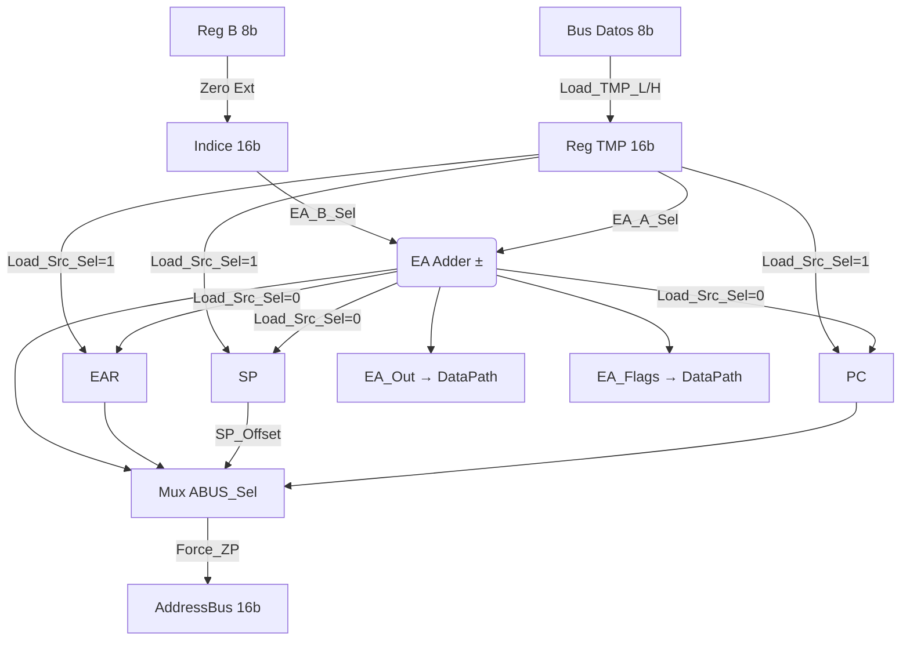

# Address Path (16-bit)

El **Address Path** es el subsistema de 16 bits encargado de generar y gestionar todas las direcciones de memoria. Opera en paralelo con el Data Path y es coordinado por la Unidad de Control mediante la palabra de control `control_bus_t`.

En el pipeline de 4 etapas (FETCH | DECODE | EXEC | WB), el AddressPath presenta `AddressBus` a la memoria en cada ciclo: durante FETCH proporciona el PC; durante EXEC proporciona la dirección efectiva calculada (EAR, SP, o resultado directo del sumador EA).

## Archivos

| Archivo | Descripción |
| --- | --- |
| `processor/AddressPath.vhdl` | Implementación del Address Path |
| `processor/AddressPath_pkg.vhdl` | Constantes de control (`PC_OP_*`, `SP_OP_*`, `ABUS_SRC_*`, `EA_*`) |

---

## Registros Internos

| Registro | Ancho | Valor inicial | Descripción |
| --- | --- | --- | --- |
| **PC** | 16 | `0x0000` | Program Counter. Apunta a la próxima instrucción. Se incrementa +1 por byte leído; se carga en saltos. |
| **SP** | 16 | `0xFFFE` | Stack Pointer. Crece hacia abajo en palabras de 16 bits (PUSH: SP−2; POP: SP+2). Inicia alineado a par. |
| **LR** | 16 | `0x0000` | Link Register. Captura PC en `BSR`/`CALL LR` para retorno sin stack. |
| **EAR** | 16 | `0x0000` | Effective Address Register. Captura el resultado del sumador EA para mantenerlo estable en el bus de salida durante accesos multi-ciclo. |
| **TMP** | 16 | `0x0000` | Registro de ensamblado de 16 bits. Se carga byte a byte desde el bus de datos de 8 bits (`TMP_L` y `TMP_H`). |

---

## Sumador EA (Effective Address Adder)

Unidad aritmética combinacional de 16 bits que calcula `EA = Base ± Índice`.

| Señal | Opciones | Descripción |
| --- | --- | --- |
| `EA_A_Sel` | TMP / PC / A:B / SP | Selecciona el operando base del sumador |
| `EA_B_Sel` | B (zero-ext) / DataIn (sign-ext) / TMP | Selecciona el operando índice/desplazamiento |
| `EA_Op` | `0`=ADD / `1`=SUB | Operación del sumador |
| `Clear_TMP` | — | Fuerza TMP a `0x0000` antes de cargar (prioridad sobre `Load_TMP_L/H`) |

**Usos del sumador EA:**

- Direccionamiento indexado: `TMP + B` → `[nn+B]`
- Saltos relativos: `PC + rel8` (DataIn con extensión de signo)
- Operaciones 16-bit: `A:B + TMP` → `ADD16`/`SUB16`
- Direccionamiento indirecto zero-page: `0 + B` → `[B]`

---

## Control del Bus de Direcciones

`ABUS_Sel` multiplexa la fuente de `AddressBus`:

| Valor | Fuente | Uso típico |
| --- | --- | --- |
| `ABUS_SRC_PC` | PC | Fetch de instrucciones (etapa FETCH) |
| `ABUS_SRC_SP` | SP o SP+1 | Operaciones de stack (PUSH/POP/CALL/RET) |
| `ABUS_SRC_EAR` | EAR | Accesos a datos calculados (LD/ST multi-ciclo) |
| `ABUS_SRC_EA_RES` | Resultado directo del sumador EA | Saltos indirectos, primer acceso indexado |
| `ABUS_SRC_VEC_*` | Vectores de interrupción | Fetch de vectores NMI/IRQ |

`SP_Offset='1'` selecciona SP+1 en lugar de SP, para acceder al byte alto de palabras en la pila (little-endian).

`Force_ZP='1'` fuerza el byte alto del bus de salida a `0x00`, implementando el wrapping a página cero para el modo `[n]`.

---

## Interfaz Completa

| Puerto | Dir | Ancho | Descripción |
| --- | --- | --- | --- |
| `clk` | IN | 1 | Reloj del sistema |
| `reset` | IN | 1 | Reset síncrono activo alto; registros a valores iniciales |
| `DataIn` | IN | 8 | Bus de datos de 8 bits desde memoria; alimenta `TMP_L`, `TMP_H` y el operando B del sumador EA |
| `Index_B` | IN | 8 | Registro B del DataPath; índice en modos `[nn+B]` y `[B]` |
| `Index_A` | IN | 8 | Registro A del DataPath; forma el par `A:B` de 16 bits para `ADD16`/`SUB16` |
| `AddressBus` | OUT | 16 | Bus de direcciones hacia memoria; controlado por `ABUS_Sel` |
| `PC_Out` | OUT | 16 | Valor actual de PC hacia DataPath; necesario en el mismo ciclo que `CALL`/`BSR` (combinacional) |
| `EA_Out` | OUT | 16 | Resultado del sumador EA hacia DataPath; para `ADD16`/`SUB16` y `ST SP` |
| `EA_Flags` | OUT | 8 | Flags (C, Z) del sumador EA hacia DataPath; se activan cuando `F_Src_Sel=1` |
| `PC_Op` | IN | 2 | Control PC: NOP / INC+1 / LOAD (salto absoluto) / LOAD_L (salto misma página) |
| `SP_Op` | IN | 2 | Control SP: NOP / INC+2 (POP) / DEC−2 (PUSH) / LOAD (carga directa) |
| `ABUS_Sel` | IN | 3 | Selecciona la fuente de `AddressBus` |
| `Load_LR` | IN | 1 | `'1'` = captura PC en LR (Link Register) para `BSR`/`CALL LR` |
| `Load_EAR` | IN | 1 | `'1'` = captura resultado EA en EAR (Effective Address Register) |
| `Load_TMP_L` | IN | 1 | `'1'` = carga bits [7:0] de TMP desde `DataIn` |
| `Load_TMP_H` | IN | 1 | `'1'` = carga bits [15:8] de TMP desde `DataIn` |
| `Load_Src_Sel` | IN | 1 | `0`=EA_Adder (salto relativo PC+rel8), `1`=TMP (dirección absoluta ensamblada) |
| `SP_Offset` | IN | 1 | `0`=SP, `1`=SP+1 (byte alto, little-endian) |
| `Force_ZP` | IN | 1 | `'1'` = fuerza MSB del bus de salida a `0x00` (página cero, modo `[n]`) |
| `EA_A_Sel` | IN | 2 | Operando base del sumador EA: TMP / PC / A:B / SP |
| `Clear_TMP` | IN | 1 | `'1'` = limpia TMP a `0x0000`; prioridad sobre `Load_TMP_L/H` |
| `EA_B_Sel` | IN | 2 | Operando índice del sumador EA: B / DataIn(signed) / TMP |
| `EA_Op` | IN | 1 | `0`=ADD (EA=A+B), `1`=SUB (EA=A−B) |

---

## Diagrama de Flujo de Datos

