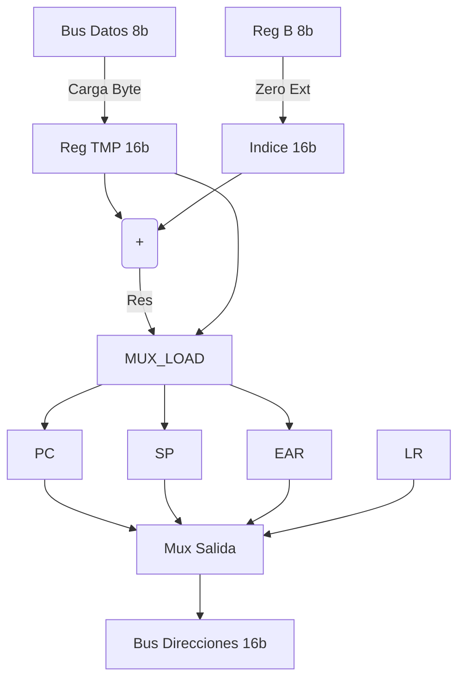

# Address Path (16-bit)

El **Address Path** es el subsistema encargado de generar y gestionar las direcciones de 16 bits para acceder a la memoria. Opera en paralelo con el Data Path.

## Arquitectura

Este bloque implementa la aritmética de punteros y el flujo de programa. Contiene registros de 16 bits y un sumador dedicado para cálculos de direcciones efectivas (EA).

### Registros Internos

| Registro | Descripción | Uso Principal |
|---|---|---|
| **PC** | Program Counter | Dirección de la próxima instrucción. Soporta incremento (+1) y carga paralela (saltos). |
| **SP** | Stack Pointer | Puntero de pila. Soporta incremento/decremento (+2/-2) para operaciones de palabra. |
| **LR** | Link Register | Almacena la dirección de retorno para llamadas a subrutinas (`CALL`, `BSR`). |
| **EAR** | Effective Address | Almacena el resultado del sumador EA para mantenerlo estable en el bus de direcciones. |
| **TMP** | Temporal 16-bit | Registro de ensamblado. Se carga byte a byte desde el bus de datos de 8 bits (`DataIn`). |

### Sumador EA (Effective Address Adder)

Unidad aritmética combinacional de 16 bits dedicada y flexible.

* **Entrada A (Base):** Multiplexada entre `TMP` y `PC`.
* **Entrada B (Índice):** Multiplexada entre `Index_B` (del DataPath), `DataIn` (para saltos relativos) y `0`.
* **Función:** `Resultado = Base + Índice`.
* **Uso:** Cálculo de direcciones indexadas (`[nn+B]`), saltos relativos (`PC + rel8`), etc.

## Control del Bus de Direcciones (`ABUS_Sel`)

El bus de salida `AddressBus` se multiplexa entre las fuentes internas:

* `ABUS_SRC_PC` (00): Fetch de instrucciones.
* `ABUS_SRC_SP` (01): Operaciones de Stack (PUSH/POP).
* `ABUS_SRC_EAR` (10): Accesos a datos calculados (LD/ST).
* `ABUS_SRC_EA_RES` (11): Salida directa del resultado del sumador EA.

## Diagrama de Flujo de Datos

