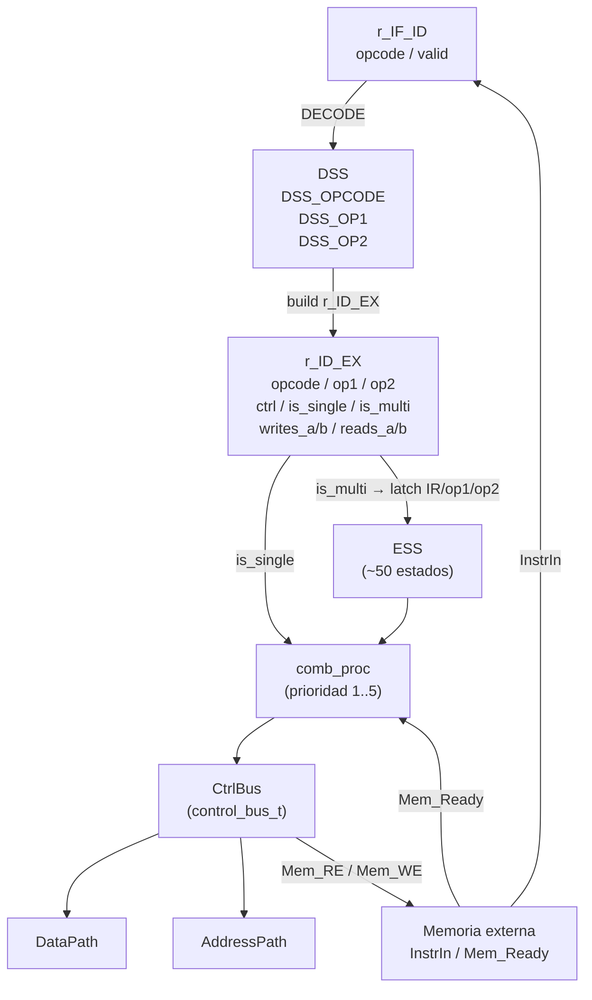

# Control Unit (Pipeline de 4 etapas)

La **Control Unit** implementa el núcleo de control del procesador como una máquina de estados pipelineada de 4 etapas (IF → ID → EX → WB). En cada ciclo de reloj genera la palabra de control `control_bus_t` que pilota simultáneamente al DataPath, al AddressPath y al bus de memoria.

A partir de la versión 0.8 se añade solapamiento **DECODE+EX** para instrucciones de 1 byte y 1 ciclo, logrando throughput de 1 ciclo por instrucción en cadenas de operaciones ALU consecutivas.

## Archivos

| Archivo | Descripción |
| --- | --- |
| `processor/ControlUnit.vhdl` | Implementación de la architecture `pipeline` |
| `processor/Pipeline_pkg.vhdl` | Tipos `IF_ID_reg_t`, `ID_EX_reg_t`, `dss_t`, `ess_t` |
| `processor/ControlUnit_pkg.vhdl` | Tipo `control_bus_t` y constante `INIT_CTRL_BUS` |

---

## Pipeline de 4 Etapas

```
Ciclo N    | Ciclo N+1 | Ciclo N+2 | Ciclo N+3
-----------+-----------+-----------+----------
IF         | ID        | EX        | WB (implícito al final de EX)
```

El write-back se realiza al flanco ascendente que concluye la etapa EX, en el mismo ciclo de reloj, sin etapa WB separada. La instrucción siguiente puede leer el valor actualizado en el ciclo siguiente.

| Etapa | Registro de pipeline | Actividad |
| --- | --- | --- |
| **IF** | → `r_IF_ID` | Presenta `ABUS=PC`, `Mem_RE=1`; captura `InstrIn` en `r_IF_ID` al flanco siguiente |
| **ID** | `r_IF_ID` → `r_ID_EX` | Decodifica el opcode; construye `ctrl`, detecta hazards RAW, avanza `dss` para operandos multi-byte |
| **EX** | `r_ID_EX` → — | Instrucción de 1 ciclo: `r_ID_EX.ctrl` conduce directamente el `CtrlBus`. Instrucción multi-ciclo: activa la sub-FSM ESS |
| **WB** | (implícito) | El banco de registros y el Registro F capturan el resultado al flanco de subida del reloj que cierra EX |

---

## Registros de Pipeline

### `r_IF_ID` — Registro IF/ID

| Campo | Tipo | Descripción |
| --- | --- | --- |
| `valid` | `std_logic` | `'1'` cuando contiene un opcode válido capturado de memoria |
| `opcode` | `data_vector` | Byte de instrucción leído de `InstrIn` |

### `r_ID_EX` — Registro ID/EX

| Campo | Tipo | Descripción |
| --- | --- | --- |
| `valid` | `std_logic` | `'1'` cuando contiene una instrucción lista para ejecutar |
| `opcode` | `data_vector` | Opcode original (usado por ESS para el dispatch) |
| `op1` | `data_vector` | Primer byte de operando (instrucciones de 2 o 3 bytes) |
| `op2` | `data_vector` | Segundo byte de operando (instrucciones de 3 bytes) |
| `ctrl` | `control_bus_t` | Palabra de control pre-decodificada para instrucciones de 1 ciclo |
| `writes_a` | `std_logic` | Tag de hazard: la instrucción escribe el registro A |
| `writes_b` | `std_logic` | Tag de hazard: la instrucción escribe el registro B |
| `reads_a` | `std_logic` | Tag de hazard: la instrucción lee el registro A |
| `reads_b` | `std_logic` | Tag de hazard: la instrucción lee el registro B |
| `is_single` | `std_logic` | `'1'` = ejecución en 1 ciclo; `ctrl` se usa directamente |
| `is_multi` | `std_logic` | `'1'` = ejecución multi-ciclo; la sub-FSM ESS toma el control |

---

## Sub-Estados FSM

La arquitectura mantiene dos sub-máquinas de estados ortogonales que operan secuencialmente:

### `dss` — Decode Sub-State

Controla la etapa ID cuando la instrucción necesita capturar bytes de operando antes de poderse decodificar completamente.

| Estado | Significado |
| --- | --- |
| `DSS_OPCODE` | Primer ciclo de decodificación: el opcode está en `r_IF_ID`; se elige la ruta (1B/2B/3B) |
| `DSS_OP1` | Esperando el primer byte de operando en `InstrIn`; `r_IF_ID` se mantiene con el opcode |
| `DSS_OP2` | Esperando el segundo byte de operando; `r_ID_EX.op1` ya contiene el byte anterior |

### `ess` — Exec Sub-State

Controla la etapa EX cuando la instrucción requiere varios ciclos de memoria o de cómputo. Mientras `ess ≠ ESS_IDLE`, el pipeline está congelado (sin fetch ni decode nuevos).

Las cadenas de estados más importantes:

| Instrucción | Cadena ESS | Ciclos |
| --- | --- | --- |
| `LD A/B, [nn]` (abs.) | `TMP_FROM_OP1 → TMP_FROM_OP2 → LD_ABS → LD_WB` | 4 |
| `LD A/B, [n]` (zp) | `TMP_FROM_OP1 → LD_ABS → LD_WB` | 3 |
| `LD A/B, [nn+B]` (idx.) | `TMP_FROM_OP1 → TMP_FROM_OP2 → LD_IDX → LD_WB` | 4 |
| `ST A/B, [nn]` | `TMP_FROM_OP1 → TMP_FROM_OP2 → ST_ABS` | 3 |
| `PUSH *` | `PUSH_1 → PUSH_2 → PUSH_3` | 3 |
| `POP A/B/F` | `POP_1 → POP_2 → [POP_F_2]` | 2–3 |
| `POP A:B` | `POP_1 → POP_AB_2 → POP_AB_3` | 3 |
| `CALL nn` | `TMP_FROM_OP1 → TMP_FROM_OP2 → CALL_3..6` | 6 |
| `RET` | `RET_1 → RET_2 → RET_3` | 3 |
| `RTI` | `RTI_1 → RTI_2 → RTI_3 → RTI_4 → JP_3` | 5 |
| `NMI / IRQ` | `INT_1..INT_9` | 9 |
| `JP nn` | `TMP_FROM_OP1 → TMP_FROM_OP2 → JP_3` | 3 |
| `JP ([nn])` | `IND_LOAD → IND_READ_L → IND_READ_H → JP_3` | 4 |
| `BEQ/BNE/... (tomado)` | `BRANCH_2` | 2 |
| `ADD16/SUB16 #n` | `TMP_FROM_OP1 → OP16_WB1 → OP16_WB2` | 3 |
| `ADD16/SUB16 #nn` | `TMP_FROM_OP1 → TMP_FROM_OP2 → OP16_WB1 → OP16_WB2` | 4 |
| `IN A, #n` / `OUT #n, A` | `TMP_FROM_OP1 → IN_READ → IN_WB` / `TMP_FROM_OP1 → OUT_WRITE` | 3/2 |
| `HALT` | `ESS_HALT` (espera IRQ/NMI indefinidamente) | ∞ |

---

## Diagrama de Bloques



---

## Señales Internas Clave

| Señal | Tipo | Descripción |
| --- | --- | --- |
| `r_IF_ID` | `IF_ID_reg_t` | Registro de pipeline IF → ID |
| `r_ID_EX` | `ID_EX_reg_t` | Registro de pipeline ID → EX |
| `dss` | `dss_t` | Sub-estado de decodificación (gestión de operandos multi-byte) |
| `ess` | `ess_t` | Sub-estado de ejecución multi-ciclo |
| `r_exec_IR` | `data_vector` | Opcode latched al inicio del ESS (inmutable durante la secuencia) |
| `r_exec_op1` | `data_vector` | Primer operando latched al inicio del ESS |
| `r_exec_op2` | `data_vector` | Segundo operando latched al inicio del ESS |
| `I_Flag` | `std_logic` | Registro interno de la bandera de interrupción (SEI/CLI); sincronizado con el banco de flags |
| `handling_nmi` | `std_logic` | `'1'` durante una secuencia NMI activa; impide que una IRQ simultánea interfiera |

---

## Procesamiento de Hazards RAW

La detección se realiza en la transición DSS_OPCODE → `r_ID_EX`: los tags `reads_a`/`reads_b` de la instrucción en `r_IF_ID` se comparan con `writes_a`/`writes_b` de la instrucción en `r_ID_EX`.

> **Situación actual (v0.8):** el solape DECODE+EX se aplica únicamente a instrucciones `is_single='1'`. En ese caso, la escritura del EX(I) ocurre al mismo flanco ascendente en que se hace DECODE(I+1), por lo que el dato ya es correcto cuando EX(I+1) lo lee en el ciclo siguiente. **No se necesita stall ni forwarding** para este subconjunto.

El forwarding EX→EX (`Fwd_A_En`) está conectado a `'0'` permanentemente y su infraestructura está lista para una implementación futura que lo active cuando haya conflictos reales entre instrucciones multi-ciclo consecutivas.

---

## Solapamiento DECODE+EX (v0.8)

Las instrucciones identificadas por `is_1byte_single_f()` pueden solapar su decodificación con la ejecución de la instrucción anterior, siempre que ésta también sea `is_single='1'`:

```
Ciclo k   | DECODE instr[I]   | EX instr[I-1]  ← solapamiento
Ciclo k+1 | DECODE instr[I+1] | EX instr[I]    ← throughput: 1 ciclo/instrucción
```

**Condición de activación (en `seq_proc`):**

```vhdl
if r_IF_ID.valid = '1' and
   (r_ID_EX.valid = '0' or (r_ID_EX.valid = '1' and r_ID_EX.is_single = '1')) then
    -- DECODE puede avanzar
```

**Captura anticipada del siguiente opcode:** después de decodificar una instrucción de 1B/1ciclo, el combinacional ya ha presentado `ABUS=PC` / `Mem_RE=1` durante ese mismo ciclo. En el flanco ascendente siguiente se captura `InstrIn` directamente en `r_IF_ID`:

```vhdl
if v_did_decode_1byte and Mem_Ready = '1' then
    r_IF_ID <= (valid => '1', opcode => InstrIn);
end if;
```

**Instrucciones elegibles** (`is_1byte_single_f`):

| Grupo | Opcodes |
| --- | --- |
| Sistema | `NOP` (0x00), `SEC` (0x02), `CLC` (0x03), `SEI` (0x04), `CLI` (0x05) |
| Transferencia | `LD A,B` (0x10), `LD B,A` (0x20) |
| ALU registro | `ADD..MUH` (0x90–0x99): ADD, ADC, SUB, SBB, AND, OR, XOR, CMP, MUL, MUH |
| ALU unario | `NOT..SWAP` (0xC0–0xCE): NOT, NEG, INC, DEC, INC B, DEC B, CLR, SET, LSL, LSR, ASL, ASR, ROL, ROR, SWAP |

---

## Proceso Combinacional: prioridades de `CtrlBus`

`comb_proc` calcula el valor de `CtrlBus` en función del estado actual, siguiendo un esquema de prioridades excluyentes:

| Prioridad | Condición | Función |
| --- | --- | --- |
| **1** | `ess ≠ ESS_IDLE` | Ejecutar el micro-paso actual del ESS (instrucción multi-ciclo) |
| **2** | `r_ID_EX.valid='1'` y `is_single='1'` | Aplicar `r_ID_EX.ctrl` directamente; calcular si se puede hacer fetch simultáneo |
| **3** | `r_ID_EX.valid='1'` y `is_multi='1'` | Esperar: EX está a punto de iniciar ESS; no hacer fetch |
| **4** | Pipeline vacío (`ess=IDLE`, `r_ID_EX.valid='0'`) | Fetch del siguiente opcode si `r_IF_ID.valid='0'` |
| **5** | Operand fetch (`dss=DSS_OP1` ó `DSS_OP2`) | Presentar `ABUS=PC` / `Mem_RE=1` para capturar el siguiente byte de operando |

La lógica de fetch (prioridades 2 y 4) sólo se activa cuando `v_needs_mem=false`, es decir, cuando el bus de memoria no está siendo usado por el ESS o por un acceso a datos.

---

## Interrupciones

Las interrupciones (NMI e IRQ) se comprueban en dos puntos:

1. **Pipeline vacío** (`r_IF_ID.valid='0'`, `r_ID_EX.valid='0'`, `ess=ESS_IDLE`): la UC toma la interrupción e inicia `ESS_INT_1..INT_9`.

2. **Estado HALT** (`ess=ESS_HALT`): la UC comprueba cada ciclo si `NMI='1'` o `IRQ='1'` con `I_Flag='1'`, y en ese caso también inicia `ESS_INT_1`.

La secuencia de entrada a interrupción (9 ciclos) realiza:

```
INT_1: SP -= 2
INT_2: mem[SP]   ← PC_L
INT_3: mem[SP+1] ← PC_H
INT_4: SP -= 2
INT_5: mem[SP]   ← F
INT_6: mem[SP+1] ← 0x00
INT_7: TMP_L ← mem[vector_L]   (0xFFFE / 0xFFFA)
INT_8: TMP_H ← mem[vector_H]
INT_9: PC ← TMP; I_Flag ← 0; handling_nmi ← 0
```

`RTI` invierte la secuencia: restaura F, PC y reactiva `I_Flag='1'` antes de retornar.

---

## Interfaz

| Puerto | Dir | Ancho | Descripción |
| --- | --- | --- | --- |
| `clk` | IN | 1 | Reloj del sistema |
| `reset` | IN | 1 | Reset síncrono activo alto; todos los registros de pipeline a NOP |
| `FlagsIn` | IN | 8 | Registro F actual (C,H,V,Z,G,E,R,L) desde el DataPath; usado en evaluación de ramas |
| `InstrIn` | IN | 8 | Bus de datos entrante desde memoria; puede ser opcode u operando según la etapa activa |
| `Mem_Ready` | IN | 1 | Handshake: el acceso a memoria se considera efectivo sólo cuando esta señal es `'1'` |
| `IRQ` | IN | 1 | Interrupción enmascarable; aceptada sólo si `I_Flag='1'` |
| `NMI` | IN | 1 | Interrupción no enmascarable; prioridad máxima |
| `CtrlBus` | OUT | — | Palabra de control completa (`control_bus_t`) hacia DataPath, AddressPath y bus de memoria |

---

## Funciones Helper

| Función | Descripción |
| --- | --- |
| `branch_taken_f(opcode, flags)` | Evalúa la condición de salto de los opcodes `0x71`, `0x80..0x8B` sobre `FlagsIn` |
| `reads_a_f(op)` / `reads_b_f(op)` | Determinan si el opcode lee A o B; usadas para tags de hazard en `r_ID_EX` |
| `writes_a_f(op)` / `writes_b_f(op)` | Determinan si el opcode escribe A o B; usadas para tags de hazard en `r_ID_EX` |
| `build_alu_reg(opcode)` | Construye la palabra de control para opcodes ALU registro-registro (0x90–0x99) |
| `build_alu_imm(opcode)` | Construye la palabra de control para opcodes ALU inmediato (0xA0–0xA7); activa `ALU_Bin_Sel='1'` |
| `build_alu_unary(opcode)` | Construye la palabra de control para operaciones unarias/desplazamientos (0xC0–0xCE) |
| `is_1byte_single_f(op)` | `true` si el opcode es de 1 byte y ejecuta en 1 ciclo; habilita el solapamiento DECODE+EX |
