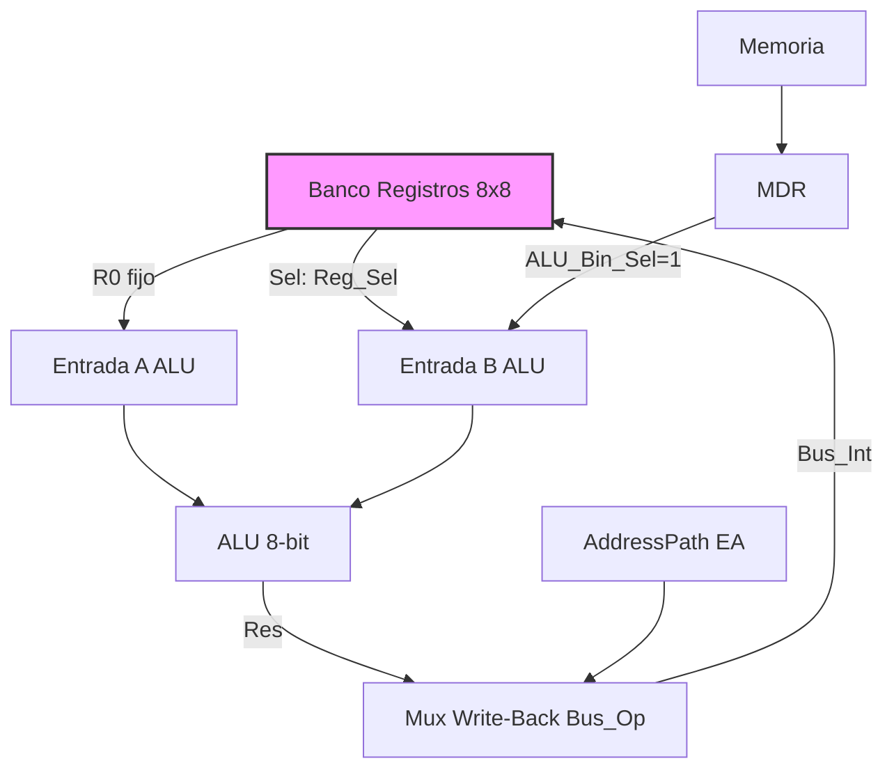

# Data Path (8-bit)

El **Data Path** es el núcleo de ejecución de 8 bits del procesador. Gestiona el almacenamiento de datos en el banco de registros, la ejecución aritmético-lógica (ALU), la interfaz de datos con la memoria (MDR) y el registro de flags.

En el pipeline de 4 etapas (FETCH | DECODE | EXEC | WB), el DataPath recibe la palabra de control `control_bus_t` de la Unidad de Control y ejecuta la micro-operación correspondiente en la etapa **EXEC**, escribiendo el resultado en la etapa **WB** del mismo ciclo.

## Archivos

| Archivo | Descripción |
| --- | --- |
| `processor/DataPath.vhdl` | Implementación del Data Path |
| `processor/DataPath_pkg.vhdl` | Tipos, constantes y funciones auxiliares |
| `processor/ALU.vhdl` | Unidad aritmético-lógica instanciada dentro del DataPath |

---

## Arquitectura

El diseño se basa en un **Banco de Registros Unificado** de 8 entradas (R0..R7), donde:

- **R0 (A):** Acumulador. Conectado permanentemente a la entrada A de la ALU y fuente implícita de `ST`/`PUSH`.
- **R1 (B):** Registro auxiliar. Actúa como segundo operando por defecto y como índice en modos `[nn+B]`/`[B]`.
- **R2..R7:** Registros de propósito general, accesibles vía `Reg_Sel`.

Cualquier registro puede seleccionarse como operando B de la ALU mediante el multiplexor controlado por `Reg_Sel`.

### Diagrama de Bloques

---

## Componentes Clave

### 1. Banco de Registros

- 8 registros × 8 bits (R0..R7).
- **Puerto Write_A:** Escritura dedicada en R0 (Acumulador).
- **Puerto Write_B:** Escritura en el registro seleccionado por `Reg_Sel`.
- Lectura: salida A fija (R0), salida B multiplexada (`Reg_Sel`).

### 2. ALU

- Instancia del componente `ALU` (ver [ALU.md](/ALU.md)).
- Recibe R0 y el operando seleccionado del banco (o MDR si `ALU_Bin_Sel=1`).
- Genera resultado (`ALU_Res`) y flags (`ALU_Stat`).

### 3. MDR (Memory Data Register)

- Captura datos de memoria (`MemDataIn`) cuando `MDR_WE='1'` en el flanco de subida.
- Puede usarse como operando B directo de la ALU (`ALU_Bin_Sel='1'`), útil en instrucciones `LD` inmediatas.

### 4. Registro de Flags (RegF)

- Registro de 8 bits: `(C, H, V, Z, G, E, R, L)`.
- **Actualización enmascarada:** `Flag_Mask` indica qué bits se actualizan (1 = actualizar).
- **Fuente seleccionable:** `F_Src_Sel` elige entre flags de la ALU (0) o flags del AddressPath EA (1), necesario para `ADD16`/`SUB16`.
- **Carga directa:** `Load_F_Direct='1'` carga el bus interno completo en RegF (usado en `POP F` y `RTI`).

---

## Interfaz Completa

| Puerto | Dir | Ancho | Descripción |
| --- | --- | --- | --- |
| `clk` | IN | 1 | Reloj del sistema |
| `reset` | IN | 1 | Reset síncrono activo alto |
| `MemDataIn` | IN | 8 | Dato leído de memoria/IO → MDR o directamente al bus |
| `MemDataOut` | OUT | 8 | Dato a escribir en memoria/IO (fuente: `Out_Sel`) |
| `IndexB_Out` | OUT | 8 | Valor de R1 (B) hacia AddressPath para modos indexados |
| `RegA_Out` | OUT | 8 | Valor de R0 (A) hacia AddressPath para par `A:B` en 16-bit |
| `PC_In` | IN | 16 | PC desde AddressPath; necesario para `CALL`/`BSR` (guarda retorno) |
| `EA_In` | IN | 16 | Resultado EA desde AddressPath; byte bajo/alto para `ADD16`/`SUB16` y `ST SP` |
| `EA_Flags_In` | IN | 8 | Flags (C, Z) del sumador EA del AddressPath |
| `ALU_Op` | IN | 5 | Código de operación ALU (`opcode_vector`) |
| `Bus_Op` | IN | 2 | Selección de fuente del bus de escritura al banco: ALU, MDR, PC_L, PC_H, EA_L, EA_H… |
| `Write_A` | IN | 1 | Habilita escritura en R0 (Acumulador) |
| `Write_B` | IN | 1 | Habilita escritura en el registro seleccionado por `Reg_Sel` |
| `Reg_Sel` | IN | 3 | Selecciona el registro operando B (R0..R7) |
| `Write_F` | IN | 1 | Habilita actualización del registro de flags |
| `Flag_Mask` | IN | 8 | Máscara de flags: `1` = actualizar ese bit de RegF |
| `MDR_WE` | IN | 1 | Habilita escritura en MDR en el flanco de reloj |
| `ALU_Bin_Sel` | IN | 1 | Selección entrada B ALU: `0`=Reg_Sel, `1`=MDR |
| `Out_Sel` | IN | 3 | Selección fuente de `MemDataOut`: A, B, zero, PC_L, PC_H |
| `Load_F_Direct` | IN | 1 | Carga directa de RegF desde el bus interno (`POP F`, `RTI`) |
| `F_Src_Sel` | IN | 1 | Fuente de flags: `0`=ALU, `1`=AddressPath EA |
| `FlagsOut` | OUT | 8 | Registro F hacia la UC para saltos condicionales |

---

## Convención de Flags

Los flags se actualizan únicamente cuando `Write_F='1'`, y solo los bits donde `Flag_Mask(i)='1'`. Esto permite que instrucciones como `CMP` actualicen todos los flags mientras que `LD` solo actualiza `Z`.

Ver [ALU.md](/ALU.md) para la descripción completa del vector de flags `(C, H, V, Z, G, E, R, L)`.
