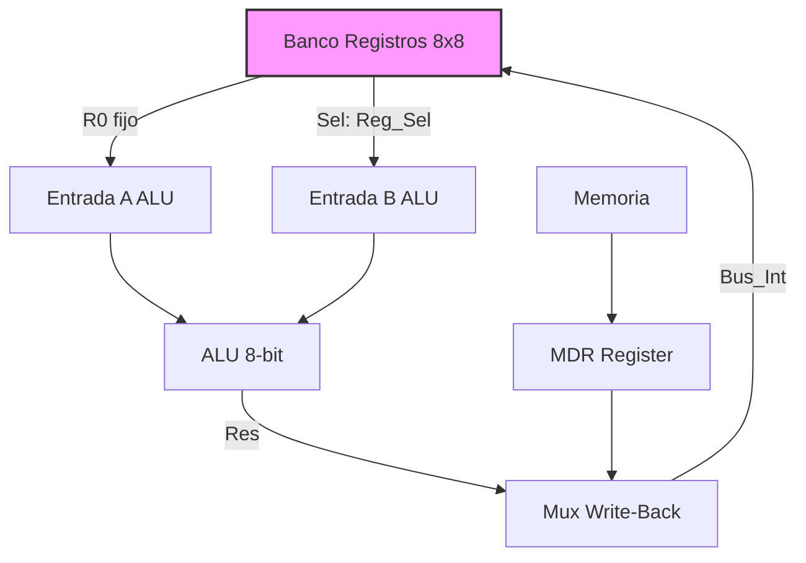

# Data Path (8-bit)

El **Data Path** es el núcleo de ejecución de 8 bits del procesador. Gestiona el almacenamiento de datos temporales (Banco de Registros), la ejecución aritmética (ALU) y la interfaz de datos con la memoria (MDR).

## Arquitectura

El diseño se basa en un **Banco de Registros Unificado** de 8 entradas, donde:

* **R0 (A):** Actúa como Acumulador. Está conectado permanentemente a la entrada A de la ALU.
* **R1 (B):** Registro auxiliar estándar.
* **R2..R7:** Registros de propósito general.

Cualquier registro (R0..R7) puede ser seleccionado como el **segundo operando (B)** de la ALU mediante el multiplexor controlado por `Reg_Sel`.

### Diagrama de Bloques Simplificado

## Componentes Clave

### 1. Banco de Registros (`Registers`)

- **Tamaño:** 8 registros de 8 bits.
* **Escritura A:** Puerto dedicado para escribir en R0 (Acumulador) habilitado por `Write_A`.
* **Escritura B:** Puerto flexible para escribir en el registro seleccionado por `Reg_Sel`, habilitado por `Write_B`.
* **Lectura:** Salida A fija (R0), Salida B multiplexada (`Reg_Sel`).

### 2. ALU (Arithmetic Logic Unit)

- Instancia del componente `ALU`.
* Recibe R0 y el operando seleccionado del banco.
* Genera resultado (`ALU_Res`) y flags (`ALU_Stat`).

### 3. Registro MDR (Memory Data Register)

- Captura datos provenientes de la memoria (`MemDataIn`) en el flanco de reloj cuando `MDR_WE = '1'`.
* Esencial para la estabilidad del pipeline al leer de memoria síncrona/asíncrona.

### 4. Gestión de Flags

- Registro `RegF` (8 bits).
* Soporta **actualización enmascarada** (`Flag_Mask`): permite modificar solo ciertos flags (ej. `CMP` afecta a todos, pero instrucciones lógicas no afectan a `V`).

## Interfaz de Control

| Señal | Dirección | Descripción |
|---|---|---|
| `ALU_Op` | IN | Opcode de la ALU (ver `ALU_pkg`). |
| `Reg_Sel` | IN | Selecciona el registro para la entrada B de la ALU y para escritura `Write_B`. |
| `Bus_Op` | IN | Selecciona la fuente del bus de escritura: `ACC_ALU_elected` (00) o `MEM_MDR_elected` (01). |
| `Out_Sel` | IN | Selecciona qué dato sale hacia memoria: `0`=RegA, `1`=RegB. |
